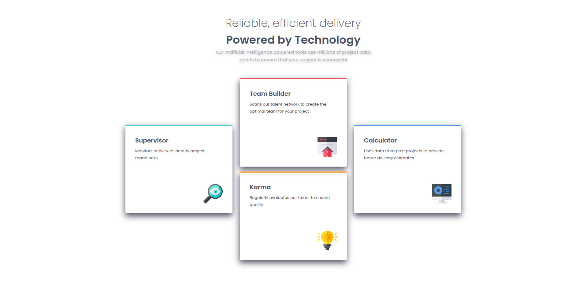

# Frontend Mentor - Four card feature section solution

This is a solution to the [Four card feature section challenge on Frontend Mentor](https://www.frontendmentor.io/challenges/four-card-feature-section-weK1eFYK). Frontend Mentor challenges help you improve your coding skills by building realistic projects.

## Table of contents

- [Overview](#overview)
  - [The challenge](#the-challenge)
  - [Screenshot](#screenshot)
  - [Links](#links)
- [My process](#my-process)
  - [Built with](#built-with)
  - [What I learned](#what-i-learned)
- [Author](#author)

**Note: Delete this note and update the table of contents based on what sections you keep.**

## Overview

### The challenge

Users should be able to:

- View the optimal layout for the site depending on their device's screen size

### Screenshot



### Links

- Solution URL: [Code repository](https://github.com/Melbita/four-card-section)
- Live Site URL: [Live Site](https://melbita.github.io/four-card-section/)

## My process

### Built with

- Semantic HTML5 markup
- CSS custom properties
- CSS Grid
- Mobile-first workflow

**Note: These are just examples. Delete this note and replace the list above with your own choices**

### What I learned

I learned how to use repeat and minmax to adjust grid columns, so the cards within the columns stretch themselves based on min

```html
grid-template-columns: repeat(3, minmax(150px, 350px));
```

Each column will try to be 350px wide, but if there isn't enough space, they will shrink down to a minimum of 150px wide. This allows the grid to be responsive and adapt to different screen sizes. If the content within a column requires more than 150px, the column will expand up to 350px to accommodate it. If the screen is wide enough to fit three 350px columns, they will all be 350px wide. If the screen is narrower, the columns will shrink proportionally, but never smaller than 150px.

## Author

- Frontend Mentor - [@melbita](https://www.frontendmentor.io/profile/melbita)
